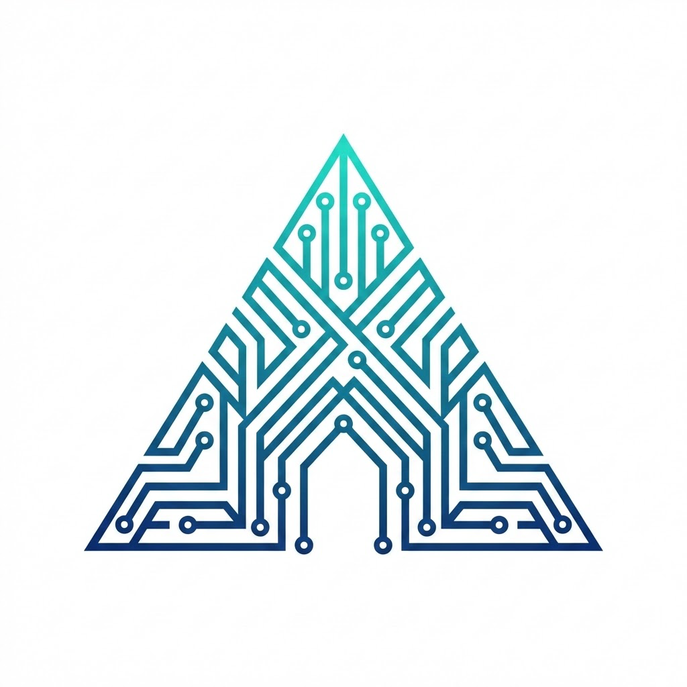

<p align="center">
  
</p>

<h1 align="center">Prism</h1>

<p align="center">
  一个面向多渠道聚合、统一鉴权、可视化运营的 AI Gateway。
</p>

Prism 是一个基于 Go + React 的 AI Gateway 项目，提供统一的 OpenAI 兼容接口、能力路由、渠道与账号管理、请求日志、计费与管理后台。它既可以作为对外 API 网关，也可以作为内部多渠道调度平台使用。

## 核心能力

- **统一 Chat 接口**：提供 `/v1/chat/completions`、`/v1/models` 等 OpenAI 兼容接口
- **多渠道路由**：同一模型可映射多个渠道，支持优先级与账号负载选择
- **多类型渠道支持**：支持 OpenAI / Anthropic / Gemini / 兼容 OpenAI 渠道等接入方式
- **管理后台**：提供渠道、账号、模型、能力、Token、日志、仪表盘等页面
- **Playground 调试台**：可直接在控制台测试模型、查看历史会话与调试信息
- **请求日志与追踪**：记录请求头、请求体、响应体、错误信息与用量
- **Token / 用户计费**：支持 Token 与用户余额体系、用量统计和费用计算
- **异步任务能力**：支持图片 / 视频类任务提交、轮询、回调、取消等流程

## 技术栈

### 后端

- Go 1.25+
- Gin
- GORM
- MySQL
- Redis
- Asynq
- Viper
- Zap

### 前端

- React 19
- TypeScript
- Vite
- Tailwind CSS
- React Router
- Recharts

## 项目结构

```text
Prism/
├── cmd/server/          # 服务启动入口
├── configs/             # 配置文件
├── console/             # React 管理后台
├── docs/                # 使用文档
├── internal/
│   ├── api/             # HTTP API、路由与中间件
│   ├── model/           # 数据模型
│   ├── provider/        # 上游渠道适配
│   ├── service/         # 业务逻辑
│   └── worker/          # 异步任务 Worker
├── pkg/                 # 配置、数据库、缓存、鉴权等公共组件
└── build.bat            # Windows 下构建 Linux AMD64 二进制
```

## 快速开始

### 1. 克隆项目

```bash
git clone https://github.com/mirainya/Prism.git
cd Prism
```

### 2. 准备依赖

- Go 1.25+
- Node.js 18+
- MySQL 8+
- Redis 6+

### 3. 配置服务

复制配置文件：

```bash
cp configs/config.example.yaml configs/config.yaml
```

然后修改 `configs/config.yaml` 中的数据库、Redis、JWT 等配置。

### 4. 启动前端开发环境

```bash
cd console
npm install
npm run dev
```

默认前端开发地址：

```text
http://localhost:3000
```

### 5. 启动后端

在项目根目录执行：

```bash
go run ./cmd/server/main.go
```

默认后端地址：

```text
http://localhost:23523
```

### 6. 构建发布版本

Windows 下可直接执行：

```bash
build.bat
```

构建完成后会在 `dist/` 目录输出 Linux AMD64 可执行文件与示例配置。

## 常用接口

### OpenAI 兼容接口

```text
GET    /v1/models
POST   /v1/chat/completions
```

### 能力接口

```text
GET    /v1/capabilities
POST   /v1/capabilities/:capability
GET    /v1/tasks/:task_no
POST   /v1/tasks/:task_no/cancel
POST   /v1/images/generations
POST   /v1/videos/generations
```

### 控制台接口

```text
POST   /api/auth/login
GET    /api/dashboard/stats
GET    /api/admin/channels
GET    /api/admin/chat-models
GET    /api/admin/chat-model-channels
GET    /api/admin/request-logs
POST   /api/playground/:token_id/chat/completions
```

## 管理后台功能

当前后台主要包含以下页面：

- 仪表盘
- 渠道管理
- 渠道账号管理
- 能力管理
- Chat 模型管理
- 模型渠道映射管理
- Token 管理
- 请求日志
- Playground 调试台
- 对话记录 / 定价 / 查询相关页面

## 文档

- 详细使用文档：[`docs/USAGE_GUIDE.md`](docs/USAGE_GUIDE.md)
- 前端说明：[`console/README.md`](console/README.md)

## 开发说明

- 配置通过 `viper` 从 `configs/config.yaml` 加载，并支持热重载
- 服务启动时会自动执行数据库连接与表迁移
- 前端构建产物可嵌入 Go 服务统一部署
- Chat 模型对上游的实际模型名由 `chat_model_channels.vendor_model` 决定

## License

MIT
